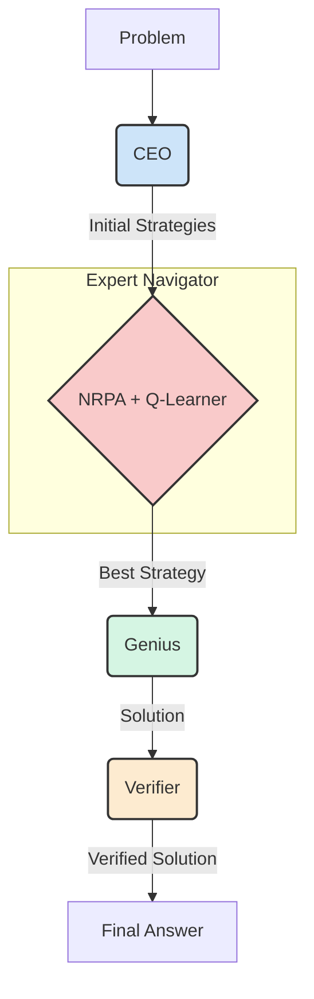

# IMO25 — CEO–Genius Multi‑Agent Solver with NRPA Strategy Search

This repository contains a research-grade framework for solving International Mathematical Olympiad (IMO) problems using a multi-agent system. The framework is enhanced with a **Nested Rollout Policy Adaptation (NRPA)** module for intelligent strategy exploration and a **Q-learning Meta-Controller** to guide the search process efficiently.

## Executive Summary

*   **Multi-Agent System:** A pipeline of specialized agents (Strategist, Worker, Improver, Verifier) work together to solve complex math problems.
*   **NRPA-Enhanced Strategy Search:** Before committing to a single plan, the system enumerates multiple strategies and uses NRPA to explore sequences of refinements, learning which approaches are most promising.
*   **Q-Learning Meta-Controller:** An intelligent "guide" that sits on top of the NRPA search, using reinforcement learning to make the exploration process more efficient. It learns when to continue, stop, or abandon a search path, saving time and computational resources.
*   **Advanced Exploration Strategies:** Includes both epsilon-greedy and Upper Confidence Bound (UCB) exploration strategies, allowing for a sophisticated balance between exploiting known good paths and exploring new ones.
*   **Telemetry and Logging:** The system produces detailed logs, including timing, iteration counts, pass/fail statistics, and telemetry data for both the NRPA search and the Q-learning meta-controller.

## The Core Problem and Our Solution

LLM-based systems often struggle with complex, multi-step reasoning problems. They can get stuck in "exploration loops," repeatedly trying similar, unproductive strategies, which is both costly and inefficient. This project addresses that problem by automating the "strategic hinting" process described in recent research.

Our solution is a hierarchical system that combines high-level strategic planning with a sophisticated, learned search mechanism. The **NRPA module**, guided by the **Q-learning meta-controller**, intelligently narrows down a wide range of possible strategies to the single most promising one, which is then executed by the downstream agents.

## System Architecture

The framework is composed of a pipeline of agents, each with a distinct role:

1.  **The CEO (Strategist):** The "expedition leader." It analyzes the problem and proposes several high-level game plans.
2.  **The NRPA + Q-Learner (Navigator):** An "expert navigator" that explores the CEO's plans.
    *   **NRPA:** A team of "scouts" that explore each path step-by-step.
    *   **Q-Learner:** An "experienced guide" that advises the scouts, using its learned knowledge to tell them which paths are promising and when to cut their losses.
3.  **The Genius (Worker):** The "lead climber." It takes the single best path from the navigator and executes it flawlessly, writing out the detailed mathematical proof.
4.  **The Verifier:** The "safety inspector." It double-checks the final solution for correctness and rigor.

### Workflow Diagram



## Key Technical Components

*   **`code/agent.py`**: The main orchestrator for the agent pipeline. It handles API routing, telemetry, backtracking, and the command-line interface.
*   **`code/nrpa.py`**: The implementation of the Nested Rollout Policy Adaptation algorithm.
*   **`code/exploration_meta.py`**: The Q-learning meta-controller (`ExplorationMetaLearner`) that guides the NRPA search. This is where the state representation, reward shaping, and exploration strategies are implemented.
*   **`code/strategy_selector.py`**: The module responsible for selecting the best strategy, using either a single-pass approach or the NRPA search.
*   **`code/prompts.py`**: Contains all the prompt templates and robust parsers for interacting with the LLMs.
*   **`code/api_utils.py`**: A centralized module for handling all interactions with external LLM providers (OpenRouter, Cerebras, Gemini).

## Running the Agent

### Setup

1.  **Clone the repository:**
    ```bash
    git clone <repository_url>
    cd <repository_directory>
    ```
2.  **Install dependencies:**
    ```bash
    pip install -r requirements.txt
    ```
3.  **Configure your environment:**
    *   Copy the `.env.example` file to `.env`.
    *   Fill in your API keys and desired model names in the `.env` file.

### Execution

The agent is run from the command line using the `run_agent.py` script.

```bash
python IMO25/run_agent.py <problem_file> [options]
```

**Arguments:**

*   `<problem_file>`: The path to the problem statement file (e.g., `imo01.txt`).

**Options:**

*   `--verbose` or `-v`: Enable verbose logging to see detailed output from the agent.
*   `--max_runs <N>`: The maximum number of times to run the agent.
*   `--exploration_strategy <strategy>`: The exploration strategy for the Q-learning meta-controller.
    *   `epsilon_greedy` (default): A simple strategy that mostly chooses the best-known action, but occasionally explores random actions.
    *   `ucb`: Upper Confidence Bound, a more advanced strategy that intelligently balances exploration and exploitation.

**Example:**

To run the agent on the first IMO problem with the UCB exploration strategy and verbose logging:

```bash
python IMO25/run_agent.py imo01.txt --verbose --exploration_strategy ucb
```

## Telemetry and Logs

*   **Logs:** All agent output is saved to sequentially numbered log files (e.g., `logs/IMO1.log`, `logs/IMO2.log`).
*   **Telemetry:** Detailed telemetry data, including performance metrics and Q-learning data, is saved to corresponding JSON files (e.g., `logs/IMO1_telemetry.json`).

## Future Work

*   **More Sophisticated State/Action Spaces:** The Q-learner's state and action spaces could be further enriched with more features to allow for even more nuanced decision-making.
*   **Automated Hyperparameter Tuning:** The learning rate, discount factor, and exploration rates could be tuned automatically.
*   **Cross-Problem Generalization:** The Q-table could be saved and loaded across different problems, allowing the agent to build up a general-purpose "mathematical intuition."

## License

This project is licensed under the MIT License. See the `LICENSE` file for details.
